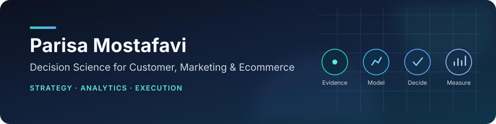

  

  
  

## Customer analytics and decision science that ends in an action

I am an analytics and customer insight leader with 7+ years of experience across marketing analytics, customer strategy, planning, budgeting, and P&L in large-scale ecommerce.

I build decision systems for questions such as **who to retain, which intervention to use, which customers to invest in, where to allocate budget, and how to measure incremental value**. Python, SQL, machine learning, causal inference, forecasting, and optimization are tools in that process—not the endpoint.

<table>
  <tr>
    <td width="50%" valign="top">
      <strong>Target roles</strong> 
      Decision Scientist · Customer Analytics · Data Scientist · Marketing Analytics
    </td>
    <td width="50%" valign="top">
      <strong>Delivery standard</strong> 
      Business framing · Baselines · Holdouts · Decision policy · Tests · CI
    </td>
  </tr>
</table>

## Start here: flagship decision systems

All public case studies use explicitly synthetic data and results generated by committed code. Metrics validate each workflow under a controlled setup; they are not claims about production performance.

<table>
  <tr>
    <td width="50%" valign="top">
      <h3><a href="https://github.com/parisaMSTFV/customer-next-best-action-engine">Customer Next Best Action Engine</a></h3>
      
<strong>Decision:</strong> Who should receive which action now—reminder, voucher, service call, or no action—under budget, consent, and channel constraints?

      
<strong>Executed evidence:</strong> The policy produced 15.4% more synthetic true incremental net value than the strongest non-oracle baseline, with 5.6% regret versus the simulation oracle.

      
<code>Decision orchestration</code> <code>Uplift</code> <code>CLV</code> <code>Optimization</code>

    </td>
    <td width="50%" valign="top">
      <h3><a href="https://github.com/parisaMSTFV/retention-treatment-uplift">Retention Treatment Uplift</a></h3>
      
<strong>Decision:</strong> Who should receive which retention intervention when budget and channel capacity are limited?

      
<strong>Executed evidence:</strong> The optimized policy produced 76.2% more simulated incremental net value than risk-only targeting on an untouched test period.

      
<code>Causal ML</code> <code>Uplift</code> <code>Policy evaluation</code> <code>Optimization</code>

    </td>
  </tr>
  <tr>
    <td width="50%" valign="top">
      <h3><a href="https://github.com/parisaMSTFV/customer-lifetime-value-decision-system">Customer Lifetime Value Decision System</a></h3>
      
<strong>Decision:</strong> Which customers warrant scarce service capacity, how uncertain is their expected 180-day contribution margin, and what investment ceiling is defensible?

      
<strong>Executed evidence:</strong> On the untouched synthetic holdout, the model reduced WAPE by 28.8% versus an RFM baseline, captured 24.2% of realized value in the top 10%, and raised calibrated 80% interval coverage to 81.4%.

      
<code>SQL</code> <code>Temporal ML</code> <code>Uncertainty</code> <code>CRM policy</code>

    </td>
    <td width="50%" valign="top">
      <h3><a href="https://github.com/parisaMSTFV/marketing-experiment-incrementality">Marketing Experiment Incrementality</a></h3>
      
<strong>Decision:</strong> Did a campaign cause additional behavior, and did the incremental gain exceed the full campaign cost?

      
<strong>Executed evidence:</strong> CUPED estimated 7.0% order lift, while full cost reconciliation showed −0.8% incremental ROI and supported a do-not-scale decision.

      
<code>Experimentation</code> <code>CUPED</code> <code>Incrementality</code> <code>Campaign economics</code>

    </td>
  </tr>
</table>

## Supporting portfolio

| Decision area | Project | What it demonstrates |
|---|---|---|
| Resource allocation | [Marketing Budget Allocation](https://github.com/parisaMSTFV/marketing-budget-allocation-optimizer) | Response curves, constrained optimization, scenario planning, and regret |
| Customer strategy | [Customer Segmentation](https://github.com/parisaMSTFV/customer-segmentation-decision-system) | Holdout evaluation, stability, RFM baseline, and testable segment actions |
| Operations planning | [Ecommerce Demand Forecasting](https://github.com/parisaMSTFV/ecommerce-demand-forecasting) | Temporal backtesting, uncertainty intervals, and capacity translation |
| Retention prioritization | [Personalized-Window Churn](https://github.com/parisaMSTFV/customer-churn-personalized-window) | Customer-specific timing, calibration, lift, and value at risk |
| Subscription economics | [Subscription Value & P&L](https://github.com/parisaMSTFV/Digiplus-subscription-value-pnl) | Portfolio P&L, renewal analysis, segmentation, and executable SQL |
| Recommendation | [Next Purchase Recommendation](https://github.com/parisaMSTFV/next-purchase-recommendation) | Purchase timing, category ranking, and temporal evaluation |

## How I work

- Start with the stakeholder decision, objective, KPI, action, and operating constraint.
- Compare against an understandable baseline and protect time-based or untouched holdouts.
- Separate prediction, causal impact, and business value so the claim matches the evidence.
- Translate model output into an explicit policy, including no-action cases and guardrails.
- Build reproducible public case studies with documented data provenance, tests, CI, and limitations.

## Core toolkit

  
  
  
  
  
  
  
  

## Public-data boundary

No employer data, schema, query, dashboard, business rule, secret, or internal threshold is published. Synthetic data is labeled as synthetic in every analytical repository, and production use would require governed data, privacy review, monitoring, and business validation.
